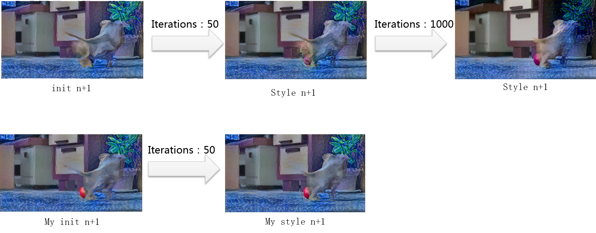

#Fast artistic video
##Introduction

This work is based on the paper “[Artistic style transfer for videos](http://arxiv.org/abs/1604.08610) ”.

Added file are listed below:

* map.lua
* imginit.lua

Changed file are listed below:

* artistic_video_core.lua
* artistic_video.lua
* stylizeVideo.sh

##Result

</img>

Our approach achieves a 10x-20x
speed up.

[video demo in youtube](https://youtu.be/qmVblhNhwNk)
## Setup

Tested with Ubuntu 14.04.

* Install torch7, loadcaffe and the CUDA backend (otherwise you have to use CPU mode which is horribly slow) and download the VGG model, as described by jcjohnson: [neural-style#setup](https://github.com/jcjohnson/neural-style#setup). Optional: Install cuDNN. This requires registration as a developer with NVIDIA, but significantly reduces memory usage. For non-Nvidia GPUs you can also use the OpenCL backend.
* To use the temporal consistency constraints, you need an utility which estimates the [optical flow](https://en.wikipedia.org/wiki/Optical_flow) between two images. You can use [DeepFlow](http://lear.inrialpes.fr/src/deepflow/) which we also used in our paper. In this case, just download both DeepFlow and DeepMatching (CPU version) from their website and place the static binaries (`deepmatching-static` and `deepflow2-static`) in the main directory of this repository. Then, the scripts included in this repository can be used to generate the optical flow for all frames as well as the certainty of the flow field. If you want to use a different optical flow algorithm, specify the path to your optical flow utility in the first line of `makeOptFlow.sh`; the flow files have to be created in the [middlebury file format](http://vision.middlebury.edu/flow/code/flow-code/README.txt).

## Requirements

A fast GPU with a large amount of video memory is recommended to execute this script. The ability to run in CPU mode is impractical due to the enormous running time.

For a resolution of 450x350, you will need at least a 4GB GPU (around 3,5 GB memory usage). If you use cuDNN, a 2GB GPU is sufficient (around 1,7GB memory usage). Memory usage scales linearly with resolution, so if you experience an out of memory error, downscale the video.

Other ways to reduce memory footprint are to use the ADAM optimizer instead of L-BFGS and/or to use the NIN Imagenet model instead of VGG-19. However, we didn't test our method with either of these and you will likely get inferior results.

## Simple style transfer

To perform style transfer with mostly the default parameters, execute `stylizeVideo.sh <path_to_video> <path_to_style_image>`. This script will perform all the steps necessary to create a stylized version of the video. Note: You have to have ffmpeg (or libav-tools for Ubuntu 14.10 and earlier) installed.

##Others
see README_OLD.md
